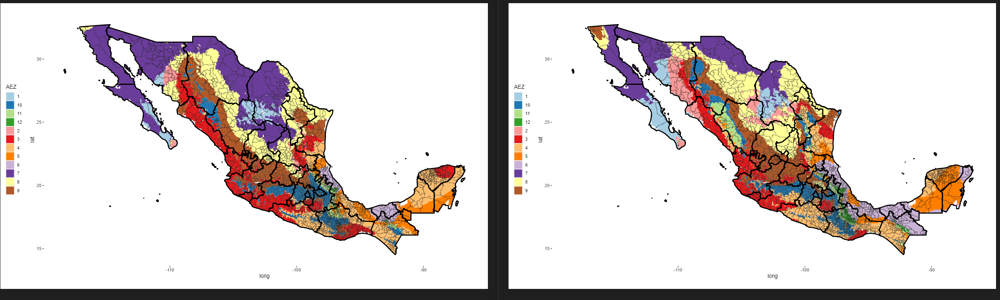

## Description of the repository

**Note (GTAP version 11)**: GTAP version 11 arrived, and Nelson Villoria (KSU) and Uris Baldos (Purdue) provided us with the newest AEZ shapefile. When we re-ran the analysis for the version 11, we found some noticeable differences that we show at the end of this readme. We are unable to determine if the differences are driven by changes in (1) data, (2) methodology, or (3) actual climate change.

The problem I solve in this repository is how to identify which Mexican municipalities belong to each Agro-ecological Zone [AEZ](https://www.ifpri.org/publication/agro-ecological-zones-africa). The importance of this problem relies on academic and research spheres for the most part.

You can also refer to our division of the United States [here](https://github.com/noejn2/AEZ18_to_UScntyFIPS).

If using this shapefile, please cite:

**TBD**

The following is a quick description of the codes:

In `assets` you should find three shapefiles for Mexican states (`assets/enti`), Mexican municipalities (`assets/muni`), and however the GTAP framework splits the globe into Agro-Ecological Zones (`assets/GTAPAEZ_v10`)

`code/Mxmap_AEZ18shp_creation.R` crates the final shapefile that can be found [here](output/MXmap_AEZ18/). The files of format [csv](output/AEZ18_to_MXmuni_id.csv) and [rds](output/AEZ18_to_MXmuni_id.rds) can be used as reference as they map the Mexican municipalities into the AEZ divisions in México

Below, I show how the split looks like, which is created using `code/low_figs_maps.R`

**Changes in AEZs from moving from GTAP v10 to v11**

Here, left map is version 10 and right map is version 11. You can notice that in almost any part of the map, we can see changes in the AEZ that will indeed affect how municipalities are mapped into the AEZ.

